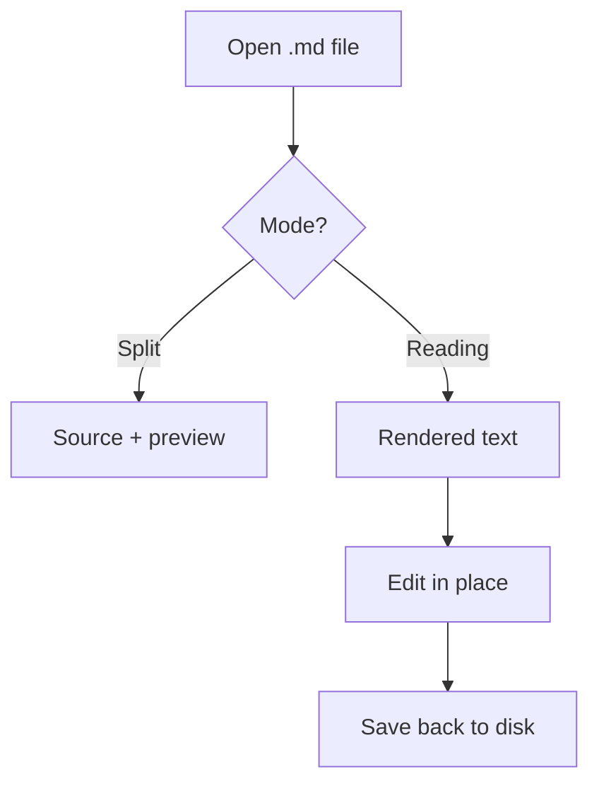

# Raster

Read and edit Markdown the way a Mac app should — clean, fast, offline.

This sample document shows everything Raster renders. Open it in **Split** mode to see source and preview side by side, or switch to **Reading** and press *Edit* to change this text directly.

> [!NOTE]
> Markdown has become the universal output format of AI. Raster is the fast, beautiful place to read, review, and edit those files.

## Reading, then editing

Raster has three modes — **Editor**, **Split**, and **Reading**. Reading mode centers the text at a comfortable measure. When you spot a typo, hit **Edit** and fix it right in the rendered text.

> [!TIP]
> Press ⌘1, ⌘2, ⌘3 to switch modes. ⌘E toggles Read / Edit inside Reading mode.

## What renders

| Feature | Status | Notes |
|---|---|---|
| GFM tables | Shipped | Like this one |
| Task lists | Shipped | With checkboxes |
| Callouts | Shipped | Five types |
| Mermaid | Shipped | Diagrams as first-class blocks |
| Scroll sync | Phase 2 | Editor ↔ preview |

### Task lists

- [x] Open a folder with ⇧⌘O
- [x] Read this file in Reading mode
- [ ] Edit a paragraph in WYSIWYG
- [ ] Export a PDF with ⇧⌘E

### Code, highlighted

```swift
struct MarkdownDocument: Identifiable {
    let id: UUID
    var url: URL?          // nil = new unsaved file
    var content: String    // source of truth
    var isDirty: Bool
}
```

Hover the block to reveal the `copy` button.

### A diagram



> [!WARNING]
> In WYSIWYG editing, code blocks and diagrams are locked — edit those in the source pane. Everything else converts back to Markdown on save.

## Files and folders

The explorer on the left shows the open folder. Click a file to open it in a tab.

> [!IMPORTANT]
> Raster saves real files, atomically. ⌘S writes straight to disk — the amber dot on the tab clears when it lands.

---

*That's it. Open your own folder and start reading.*
