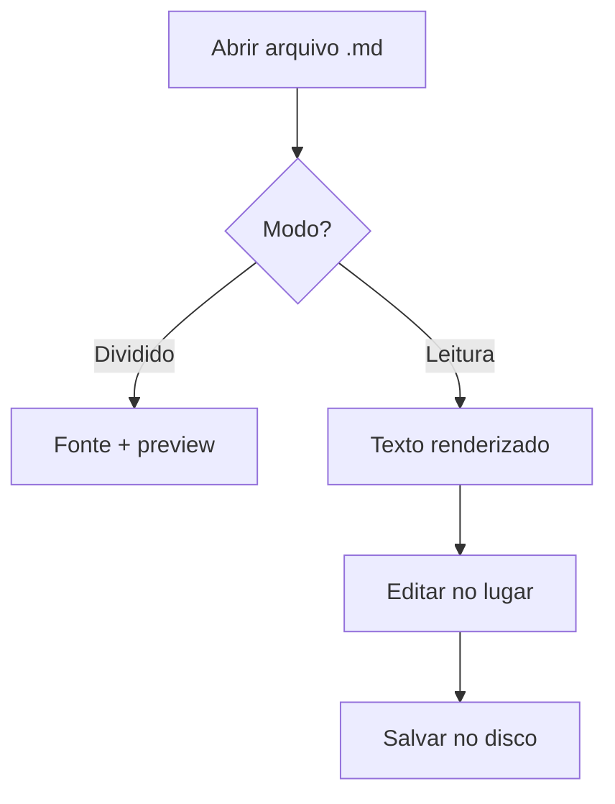

# Raster

Leia e edite Markdown como um app de Mac deve fazer — limpo, rápido, offline.

Este documento de exemplo mostra tudo o que o Raster renderiza. Abra no modo **Dividido** para ver fonte e preview lado a lado, ou mude para **Leitura** e toque em *Editar* para alterar este texto diretamente.

> [!NOTE]
> Markdown virou o formato universal de saída das IAs. O Raster é o lugar rápido e bonito para ler, revisar e editar esses arquivos.

## Ler, depois editar

O Raster tem três modos — **Editor**, **Dividido** e **Leitura**. O modo Leitura centraliza o texto numa medida confortável. Ao ver um erro de digitação, toque em **Editar** e corrija direto no texto renderizado.

> [!TIP]
> Use ⌘1, ⌘2, ⌘3 para trocar de modo. ⌘E alterna Ler / Editar dentro do modo Leitura.

## O que renderiza

| Recurso | Status | Notas |
|---|---|---|
| Tabelas GFM | Pronto | Como esta |
| Listas de tarefas | Pronto | Com checkboxes |
| Callouts | Pronto | Cinco tipos |
| Mermaid | Pronto | Diagramas nativos |

### Tarefas

- [x] Abrir uma pasta com ⇧⌘O
- [x] Ler este arquivo no modo Leitura
- [ ] Editar um parágrafo no WYSIWYG
- [ ] Exportar um PDF com ⇧⌘E

### Código com destaque

```swift
enum EditorMode {
    case editor, split, reading
}
```

### Um diagrama



> [!WARNING]
> No modo de edição WYSIWYG, blocos de código e diagramas ficam travados — edite-os no painel de fonte.

---

*É isso. Abra sua própria pasta e comece a ler.*
